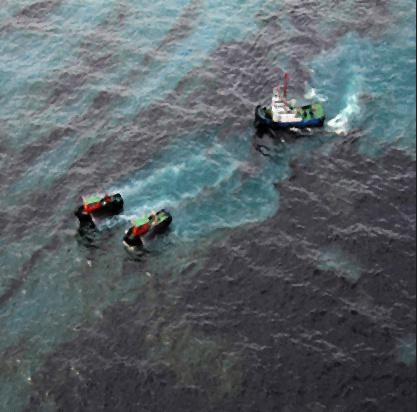
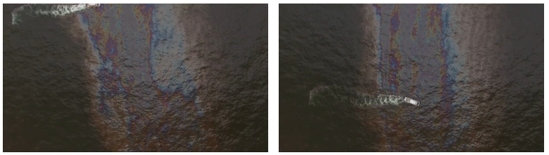
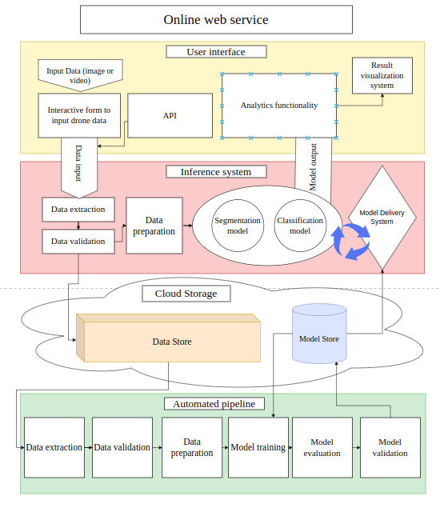
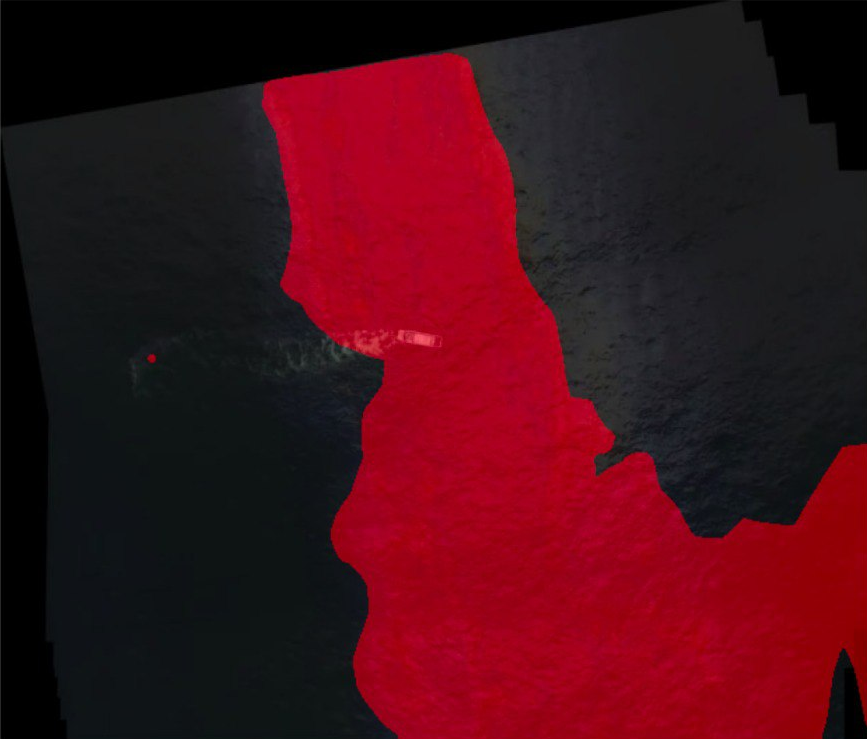

# Oil spill segmentation

Иногда на плавучих нефтедобывающих вышках происходят аварии, результатами которых является
разлив нефти. Обычно такие аварии характеризуются заметным изменением показателей на
вышке, например, перепадами давления. Для подтверждения разлива и фиксации его
характеристик снаряжается специалист на водном транспорте.

Цель данной работы - разработка автоматизированного решения для разведки водной местности
на предмет наличия разлива нефти на основе сегментации.

Задачи:
* Анализ, сбор открытых данных, разметка, аугментация.
* Формирование тренировочного и валидационного датасетов.
* Проверка гипотез.

# 1. Problem Statement

Предполагаемый итоговый результат работы включает в себя проверку различных гипотез,
оценку качества различных моделей для решения задачи сегментации. Также результатом работы
должна быть CV система, включающая в себя:
* версионирование данных
* логирование
* реестр моделей
* API
* настроенный CI/CD пайплайн.

Для определения вклада системы в бизнес был выделен ряд бизнес метрик:
* Кол-во вылетов дронов для инспекции, т.е. кол-во обращений к системе для проведения инспекции
* Среднее время, затраченное на весь процесс, от поступления запроса до предоставления результатов
* Отношение расходов на содержание и эксплуатацию систему к содержанию сотрудников и оборудования
* список ещё пополняется)

В процессе проектирования и разработки решения могут возникать следующие проблемы и ограничения:
* Возможны проблемы с закупкой product-ready вычислительного оборудования на базе GPU.
Одна из проблем - большая стоимость по сегодняшнему рынку.
* В случае масштабирования решения на множество предприятий можно столкнуться с проблемой
закрытого контура и несколькими уровнями безопасности в рамках отдельных предприятий.
* Может понадобиться дополнительная продвинутая настройка автоматизированной передачи
видео до вычислительного центра. Может потребоваться дополнительный специалист со стороны
бизнес-заказчика.
* Может понадобиться дополнительная закупка и настройка БПЛА в случае, если бизнес-заказчиком
не предусмотрено своего подготовленного оборудования.

Целевые данные, с которыми будет взаимодействовать система, могут быть либо наборами кадров
водной поверхности, либо видеозаписью всего облета местности. Пример данных:



# 2. Dataset

## 2.1. Analysis and Collection

Для обучения моделей сегментации необходимы отдельные кадры с соответствующей разметкой.
Для тестирования всей системы в целом нужны будут либо связные наборы фотографий либо
видеозаписи.

В открытом доступе, как правило, есть три типа данных для задач определения разлива нефти:

1. Табличные данные с описанием характеристик чрезвычайной ситуации. Решаемые задачи:
классификация.
2. Снимки со спутников в различных световых спектрах, например, в инфракрасном. Решаемые
задачи: детекция, сегментация, классификация.
3. Обычные фотоснимки/видеозаписи. Решаемые задачи: детекция, классификация.

В данной работе целевым типом данных является третий - набор фотографий поверхности воды
с предполагаемым разливом нефти. В результате первичного анализа открытых данных удалось
найти восемь различных наборов фотографий, либо размеченных под детекцию, либо не
размеченных вовсе [1-8] и четыре неразмеченных видеозаписи с дрона [9-12], кадры из
которых можно также использовать в качестве данных.

Для разметки данных было составлено техническое задание (могут быть внесены изменения):

Необходимо выполнить разметку для задачи сегментирования области разлива нефти на воде. Область разлива будем помечать единицей, все остальное нулём.  При наличии большого кол-ва мелких областей близко друг ко другу можно выделить их как одну область разлива. Однако, большие области необходимо отделять друг от друга, чтобы сегментированная область не содержала большой процент поверхности воды.

В результате командной разметки нами был собран набор данных из ~400 фотографий. Разметка заняла ~20 часов.
Предположительная оценка стоимости: Пусть область на изображении стоит 3 рубля. В среднем на фото 2 большие области => 1000 областей => 3000 рублей

## 2.2. Models train and test sets

**Train and test data**

В качестве тренировочных и тестовых данных были собраны три версии датасета.

Первая версия датасета (Small) самая маленькая из трех. Она содержит специфический набор
оттенков - преимущественно темная, темно-зеленая вода на которой разлив является радужным пятном,
что является следствием эффекта интерференции света, образующегося при попадании в воду
несмешивающегося с ней топлива, например, бензина. Пример представлен в пункте 2.3. Объем выборки:

|Train|Test|
|:--|:--|
|20|7|

Вторая версия датасета (Big) дополняет первую версию и включает в себя более разнообразные оттенки
цветов - ярко-голубая вода, явно выделяющиеся темные разливы, оранжевые, и другие. Пример
представлен в пункте 2.3. Объем выборки:

|Train|Test|
|:--|:--|
|300|32|

Третья версия датасета (Large) дополняет вторую версию и включает в себя аугментации данных, такие как:
отражение и поворот. Объем выборки:

|Train|Test|
|:--|:--|
|1799|63|

## 2.3. Task validation data

**Input data**

Входными данными для системы является видео с дрона с облетом водной местности.

В качестве тестового видео был взят 12 секундный кусок из [12]. Первый и последний кадры:



**Expected analytics results**

Предполагаемые выходные данные системы:
* Изображение местности с разливом
* Маска разлива
* Флаг наличия разлива
* Оценка площади разлива

# 3. Metrics

**Models Metrics**

В качестве метрики качества для обучения и тестирования моделей использовалась метрика
Intersection over Union (IoU).

**System Metrics**

В качестве метрик работы всей Inference системы в целом использовались:

* Визуальная оценка качества сегментации нефтяного разлива на тестовых видео
* Оценка средней скорости обработки видео системой

# 4. Solution

Решение включает в себя верхнеуровневую схему пайплайна проекта и результат тестирования
моделей для решения целевой задачи.

Исходя из специфики задачи рассматривались модели, позволяющие решать задачу сегментации.

## 4.1. Oil Spill Detection Pipeline



Схема описывает логику:
* передачи, хранения и обработки данных
* обучения, валидации, хранения и доставки моделей
* построения, хранения и доставки пайплайна обработки данных
* доставки результатов аналитики до клиентских устройств

## 4.2. Models Experiments

Для решения задачи были рассмотрены следующие модели:

* Попиксельная логистическая регрессия (baseline)
* Классический подход к выделению фона
* YoloV8 [13]
* Unet [14]
* MMseg [15]

В качестве гиперпараметров перебирались:

* Аугментации данных
* Оптимизаторы
* Скорость обучения
* Число эпох

Сводная таблица с результатами тестирования моделей:

| Model      | Optimizer   | Lr      | Loss Function | Epochs  | Data  | IoU
|:-----------|:------------|:--------|:--------------|:--------|:------|:---
| PW Log Reg | SGD         | 0.0001  | Log           | 100     | Small | 0.074
| Classic    | **?**       | **?**   | **?**         | **?**   | **?** | **?**
| YoloV8     | **?**       | **?**   | **?**         | **?**   | Big   | **IoU**
| Unet       | Adam        | 0.001   | BCE           | 30      | Small | 0.472
| Unet       | AdamW       | 0.001   | BCE           | 30      | Small | 0.411
| Unet       | AdamW       | 0.001   | BCE           | 90      | Big   | 0.423
| MMSeg      | Adam        | 0.001   | BCE           | 1000    | Large | 0.524

Логирование экспериментов велось в ClearMl.

## 4.3. System Experiments

В результате проведенных экспериментов была выбрана модель MMSeg.
Результат обработки тестового видео:



## 5. Installation and startup

**Locally**

Необходимо установить `poetry` и установить зависимости проекта:

```Bash
poetry install
```

После установки зависимостей можно запустить сервис:

```Bash
uvicorn src.main:app
```

**Via Dockerfile**

Для запуска сервиса как Docker контейнера, необходимо собрать образ
и запустить контейнер:

```Bash
docker build -t ovis_mvp .
docker run -p 8080:80 ovis_mvp
```


# Reference

## Data

1. https://universe.roboflow.com/drons-kogn4/oil-8sfgp/dataset/5
2. https://universe.roboflow.com/daisycat1008-outlook-com/oil-spill-detection-q6qid/dataset/2
3. https://universe.roboflow.com/university-of-jeddah-yq1po/low-high-oilspill/dataset/2
4. https://universe.roboflow.com/uav/oil22/dataset/1
5. https://universe.roboflow.com/university-of-jeddah-yq1po/oil-spill-detection-lbyf9/dataset/1/images/?split=train
6. https://universe.roboflow.com/epp15class/a-pcgz1/dataset/1/images/?split=train
7. https://www.kaggle.com/datasets/damingo1/spill-data
8. https://www.kaggle.com/datasets/kothashyamreddy/oil-spills-image-data
9. https://www.youtube.com/watch?v=UC66_PGfQX4
10. https://www.youtube.com/watch?v=PVvsG06kKNg&t=48s
11. https://www.youtube.com/watch?v=r2KMb_0OS04
12. https://www.youtube.com/watch?v=0Ly0ktQbtCw

## Models

13. https://github.com/ultralytics/ultralytics
14. https://pytorch.org/hub/mateuszbuda_brain-segmentation-pytorch_unet/
15. https://github.com/open-mmlab/mmsegmentation

